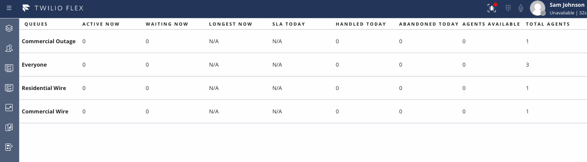

# Agent Queue Stats Example Flex Plugin

In Flex, workers with only the agent role cannot access the Queue Stats view. Hacking the Queue Stats view in results in failed API calls and an error page, so an alternative approach is needed. This plugin adds a new view to the side nav for agent users, "Agent Queue Stats."

While this example is displaying only a few statistics in the data table, additional data is being stored into Redux for you to use, including half-hour stats and worker activity breakdown by queue.

## Disclaimer

**This software is to be considered "sample code", a Type B Deliverable, and is delivered "as-is" to the user. Twilio bears no responsibility to support the use or implementation of this software.**
